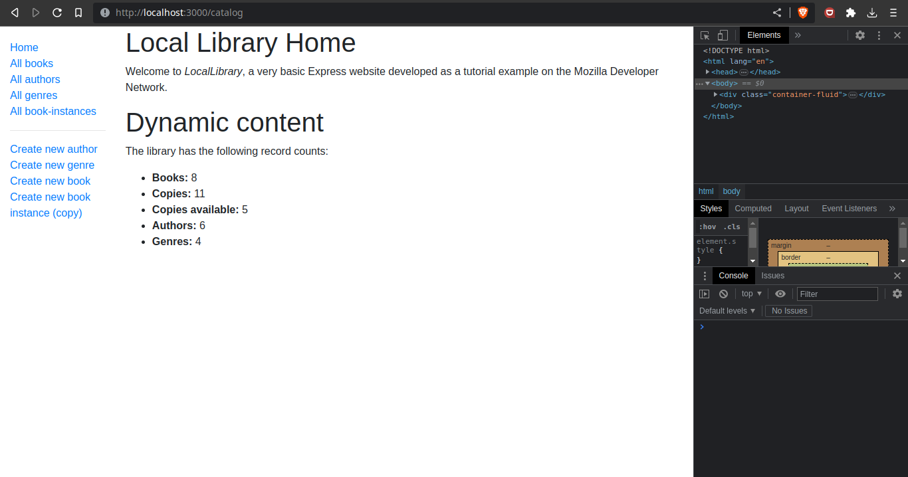
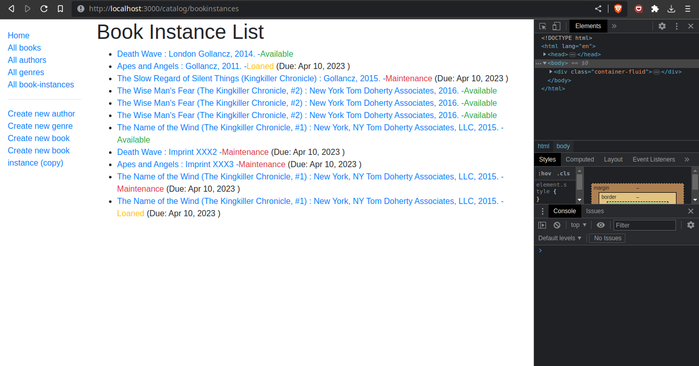
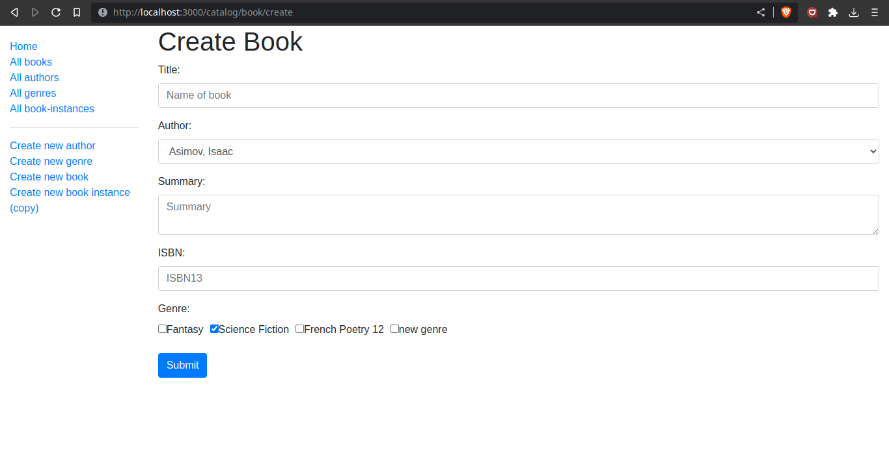
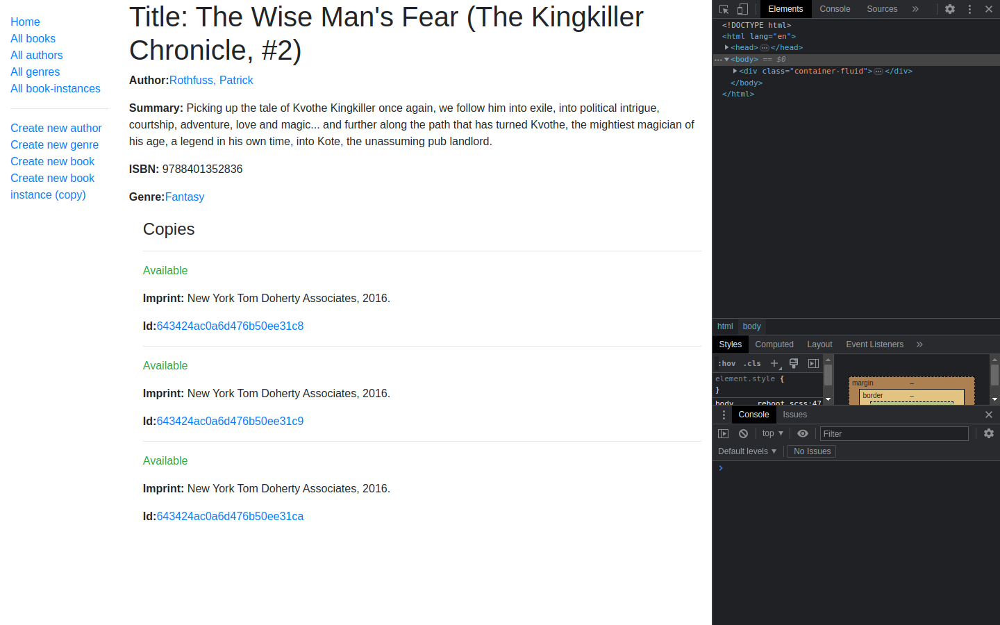

## The Local Library Web Application

- A Local Library website that provides an online catalog for a small local library, where users can browse available books and manage their accounts.
- Local Library project is made under the MDN server-side programming tutorial.

- UML association diagram:

- Flowchart for processing form requests:

- Express / Node.js / JavaScript / Pug / Mongoose (MongoDB)
- $ npm run serverstart

---

- Screenshots: 

